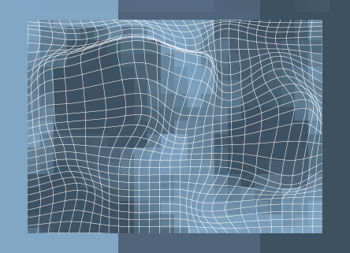

<h1>spacetimed</h1>

## About
* ⛵  Welcome aboard my profile! 
* 📚  I am constantly learning new things relating to Computer Science and beyond. 
* 🎨  This account is a documentation of different side projects I embark on to test my knowledge!

## Stats

---

 

##### **[</> spacetimed](https://github.com/spacetimed)**

